# AG Kit Dependency Graph

> Generated by `.agents/scripts/dependency_graph.py`. Do not edit manually.

Kit version: `2026.7.18` · 20 agents · 47 skills · 13 workflows

```mermaid
flowchart LR
  subgraph Workflows
    W_brainstorm["/brainstorm"]
    W_coordinate["/coordinate"]
    W_create["/create"]
    W_debug["/debug"]
    W_deploy["/deploy"]
    W_enhance["/enhance"]
    W_orchestrate["/orchestrate"]
    W_plan["/plan"]
    W_preview["/preview"]
    W_remember["/remember"]
    W_status["/status"]
    W_test["/test"]
    W_verify["/verify"]
  end
  subgraph Agents
    A_backend_specialist["backend-specialist"]
    A_code_archaeologist["code-archaeologist"]
    A_database_architect["database-architect"]
    A_debugger["debugger"]
    A_devops_engineer["devops-engineer"]
    A_documentation_writer["documentation-writer"]
    A_explorer_agent["explorer-agent"]
    A_frontend_specialist["frontend-specialist"]
    A_game_developer["game-developer"]
    A_mobile_developer["mobile-developer"]
    A_orchestrator["orchestrator"]
    A_penetration_tester["penetration-tester"]
    A_performance_optimizer["performance-optimizer"]
    A_product_manager["product-manager"]
    A_product_owner["product-owner"]
    A_project_planner["project-planner"]
    A_qa_automation_engineer["qa-automation-engineer"]
    A_security_auditor["security-auditor"]
    A_seo_specialist["seo-specialist"]
    A_test_engineer["test-engineer"]
  end
  subgraph Skills
    S_api_patterns["api-patterns"]
    S_app_builder["app-builder"]
    S_architecture["architecture"]
    S_bash_linux["bash-linux"]
    S_batch_operations["batch-operations"]
    S_behavioral_modes["behavioral-modes"]
    S_brainstorming["brainstorming"]
    S_clean_code["clean-code"]
    S_code_review_checklist["code-review-checklist"]
    S_code_review_graph["code-review-graph"]
    S_context_compression["context-compression"]
    S_coordinator_mode["coordinator-mode"]
    S_database_design["database-design"]
    S_deployment_procedures["deployment-procedures"]
    S_design_spec["design-spec"]
    S_documentation_templates["documentation-templates"]
    S_frontend_architecture["frontend-architecture"]
    S_frontend_design["frontend-design"]
    S_game_development["game-development"]
    S_geo_fundamentals["geo-fundamentals"]
    S_i18n_localization["i18n-localization"]
    S_intelligent_routing["intelligent-routing"]
    S_lint_and_validate["lint-and-validate"]
    S_mcp_builder["mcp-builder"]
    S_memory_system["memory-system"]
    S_mobile_design["mobile-design"]
    S_nextjs_react_expert["nextjs-react-expert"]
    S_nodejs_best_practices["nodejs-best-practices"]
    S_parallel_agents["parallel-agents"]
    S_performance_profiling["performance-profiling"]
    S_plan_writing["plan-writing"]
    S_powershell_windows["powershell-windows"]
    S_python_patterns["python-patterns"]
    S_red_team_tactics["red-team-tactics"]
    S_rust_pro["rust-pro"]
    S_seo_fundamentals["seo-fundamentals"]
    S_server_management["server-management"]
    S_simplify_code["simplify-code"]
    S_skillify["skillify"]
    S_systematic_debugging["systematic-debugging"]
    S_tailwind_patterns["tailwind-patterns"]
    S_tdd_workflow["tdd-workflow"]
    S_testing_patterns["testing-patterns"]
    S_verify_changes["verify-changes"]
    S_vulnerability_scanner["vulnerability-scanner"]
    S_web_design_guidelines["web-design-guidelines"]
    S_webapp_testing["webapp-testing"]
  end
  W_brainstorm --> A_project_planner
  W_brainstorm -.-> S_brainstorming
  W_coordinate --> A_orchestrator
  W_coordinate -.-> S_coordinator_mode
  W_coordinate -.-> S_parallel_agents
  W_create --> A_orchestrator
  W_create --> A_project_planner
  W_create -.-> S_app_builder
  W_create -.-> S_design_spec
  W_create -.-> S_verify_changes
  W_debug --> A_debugger
  W_debug -.-> S_systematic_debugging
  W_debug -.-> S_verify_changes
  W_deploy --> A_devops_engineer
  W_deploy -.-> S_deployment_procedures
  W_deploy -.-> S_verify_changes
  W_enhance --> A_code_archaeologist
  W_enhance -.-> S_simplify_code
  W_enhance -.-> S_clean_code
  W_enhance -.-> S_verify_changes
  W_orchestrate --> A_orchestrator
  W_orchestrate -.-> S_parallel_agents
  W_orchestrate -.-> S_coordinator_mode
  W_plan --> A_project_planner
  W_plan -.-> S_plan_writing
  W_plan -.-> S_architecture
  W_preview --> A_frontend_specialist
  W_preview -.-> S_verify_changes
  W_remember --> A_orchestrator
  W_remember -.-> S_memory_system
  W_status --> A_orchestrator
  W_status -.-> S_context_compression
  W_status -.-> S_memory_system
  W_test --> A_test_engineer
  W_test -.-> S_testing_patterns
  W_test -.-> S_verify_changes
  W_verify --> A_test_engineer
  W_verify -.-> S_verify_changes
  W_verify -.-> S_lint_and_validate
  A_backend_specialist --> S_clean_code
  A_backend_specialist --> S_nodejs_best_practices
  A_backend_specialist --> S_python_patterns
  A_backend_specialist --> S_api_patterns
  A_backend_specialist --> S_database_design
  A_backend_specialist --> S_mcp_builder
  A_backend_specialist --> S_lint_and_validate
  A_backend_specialist --> S_powershell_windows
  A_backend_specialist --> S_bash_linux
  A_backend_specialist --> S_rust_pro
  A_code_archaeologist --> S_clean_code
  A_code_archaeologist --> S_simplify_code
  A_code_archaeologist --> S_code_review_checklist
  A_database_architect --> S_clean_code
  A_database_architect --> S_database_design
  A_debugger --> S_clean_code
  A_debugger --> S_systematic_debugging
  A_devops_engineer --> S_clean_code
  A_devops_engineer --> S_deployment_procedures
  A_devops_engineer --> S_server_management
  A_devops_engineer --> S_powershell_windows
  A_devops_engineer --> S_bash_linux
  A_documentation_writer --> S_clean_code
  A_documentation_writer --> S_documentation_templates
  A_explorer_agent --> S_clean_code
  A_explorer_agent --> S_architecture
  A_explorer_agent --> S_plan_writing
  A_explorer_agent --> S_brainstorming
  A_explorer_agent --> S_systematic_debugging
  A_frontend_specialist --> S_clean_code
  A_frontend_specialist --> S_design_spec
  A_frontend_specialist --> S_nextjs_react_expert
  A_frontend_specialist --> S_frontend_architecture
  A_frontend_specialist --> S_web_design_guidelines
  A_frontend_specialist --> S_tailwind_patterns
  A_frontend_specialist --> S_frontend_design
  A_frontend_specialist --> S_lint_and_validate
  A_game_developer --> S_clean_code
  A_game_developer --> S_game_development
  A_mobile_developer --> S_clean_code
  A_mobile_developer --> S_design_spec
  A_mobile_developer --> S_mobile_design
  A_orchestrator --> S_clean_code
  A_orchestrator --> S_parallel_agents
  A_orchestrator --> S_behavioral_modes
  A_orchestrator --> S_plan_writing
  A_orchestrator --> S_brainstorming
  A_orchestrator --> S_architecture
  A_orchestrator --> S_lint_and_validate
  A_orchestrator --> S_powershell_windows
  A_orchestrator --> S_bash_linux
  A_orchestrator --> S_coordinator_mode
  A_orchestrator --> S_memory_system
  A_orchestrator --> S_context_compression
  A_orchestrator --> S_verify_changes
  A_penetration_tester --> S_clean_code
  A_penetration_tester --> S_vulnerability_scanner
  A_penetration_tester --> S_red_team_tactics
  A_penetration_tester --> S_api_patterns
  A_performance_optimizer --> S_clean_code
  A_performance_optimizer --> S_performance_profiling
  A_product_manager --> S_plan_writing
  A_product_manager --> S_brainstorming
  A_product_manager --> S_clean_code
  A_product_owner --> S_plan_writing
  A_product_owner --> S_brainstorming
  A_product_owner --> S_clean_code
  A_project_planner --> S_clean_code
  A_project_planner --> S_app_builder
  A_project_planner --> S_plan_writing
  A_project_planner --> S_brainstorming
  A_qa_automation_engineer --> S_webapp_testing
  A_qa_automation_engineer --> S_testing_patterns
  A_qa_automation_engineer --> S_web_design_guidelines
  A_qa_automation_engineer --> S_clean_code
  A_qa_automation_engineer --> S_lint_and_validate
  A_security_auditor --> S_clean_code
  A_security_auditor --> S_vulnerability_scanner
  A_security_auditor --> S_red_team_tactics
  A_security_auditor --> S_api_patterns
  A_seo_specialist --> S_clean_code
  A_seo_specialist --> S_seo_fundamentals
  A_seo_specialist --> S_geo_fundamentals
  A_test_engineer --> S_clean_code
  A_test_engineer --> S_testing_patterns
  A_test_engineer --> S_tdd_workflow
  A_test_engineer --> S_webapp_testing
  A_test_engineer --> S_code_review_checklist
  A_test_engineer --> S_lint_and_validate
```

## Contracts

- `componentApi`: `1.0.0`
- `memorySchema`: `1.0.0`
- `rulesApi`: `1.0.0`
- `workflowApi`: `1.0.0`
