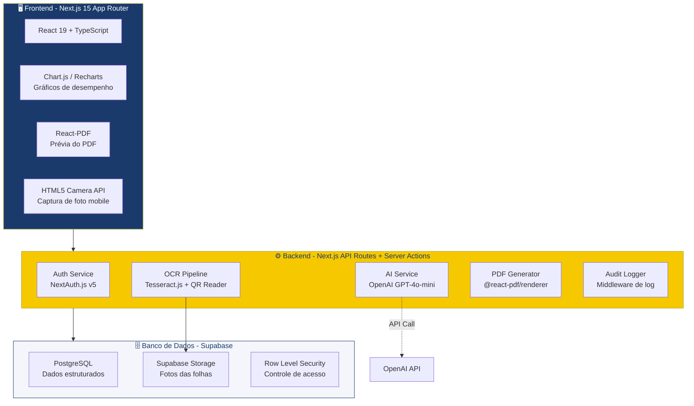
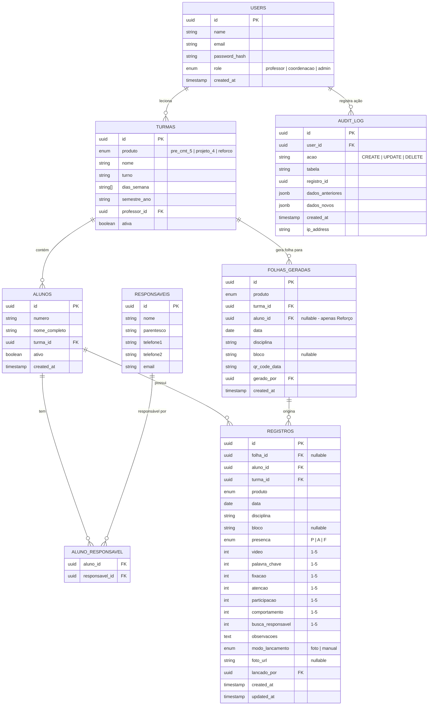

# Nota 10 Educacional — Plano de Implementação do Protótipo

> **Sistema web de acompanhamento escolar** com lançamento via foto/formulário, geração de folhas com QR Code, dashboards com gráficos e relatórios PDF com parecer pedagógico gerado por IA.

---

## Imagens de Referência do Cliente

````carousel

<!-- slide -->

<!-- slide -->

````

---

## 1. Diagrama do Sistema — Fluxo e Telas Principais

```mermaid
graph TD
    subgraph AUTH["🔐 Autenticação"]
        LOGIN["Login<br>Email + Senha"]
        LOGIN -->|Professor| PROF_HOME
        LOGIN -->|Coordenação/Admin| ADMIN_HOME
    end

    subgraph HOME["🏠 Home"]
        PROF_HOME["Home Professor<br>Atalhos rápidos + Resumo"]
        ADMIN_HOME["Home Admin<br>Dashboard geral + Métricas"]
    end

    subgraph LANCAR["📝 Lançar Registro"]
        L1["1. Escolher Produto<br>Pré-CMT 5° | Projeto 4° | Reforço"]
        L2["2. Modo de Lançamento"]
        L2_FOTO["📸 Enviar Foto da Folha<br>Upload → OCR automático"]
        L2_FORM["📝 Formulário Manual<br>Espelhado na folha impressa"]
        L3["3. Tela de Conferência<br>Revisar dados reconhecidos"]
        L4["4. Salvar Registro<br>Com log de auditoria"]
        
        L1 --> L2
        L2 --> L2_FOTO
        L2 --> L2_FORM
        L2_FOTO --> L3
        L2_FORM --> L3
        L3 --> L4
    end

    subgraph FOLHAS["📄 Gerar Folhas"]
        F1["Selecionar Produto"]
        F2_TURMA["Por Turma<br>Pré-CMT 5° / Projeto 4°"]
        F2_ALUNO["Por Aluno<br>Reforço"]
        F3["Selecionar Turma/Aluno<br>+ Data + Disciplina + Bloco"]
        F4["Gerar PDF com QR Code<br>+ Marcas de alinhamento"]
        
        F1 --> F2_TURMA
        F1 --> F2_ALUNO
        F2_TURMA --> F3
        F2_ALUNO --> F3
        F3 --> F4
    end

    subgraph CADASTROS["👥 Cadastros"]
        CAD_TURMAS["Turmas<br>Produto, turno, dias, semestre"]
        CAD_ALUNOS["Alunos<br>Nome, turma, status"]
        CAD_RESP["Responsáveis<br>Nome, telefone, parentesco"]
    end

    subgraph REGISTROS["📊 Registros / Base de Dados"]
        REG_FILTROS["Filtros<br>Produto, turma, aluno, período, disciplina"]
        REG_TABELA["Tabela de Registros<br>Com edição inline"]
        REG_LOG["Log de Alterações<br>Quem, quando, o quê"]
        
        REG_FILTROS --> REG_TABELA
        REG_TABELA --> REG_LOG
    end

    subgraph RELATORIOS["📈 Relatórios"]
        R_FILTROS["Filtros<br>Produto → Turma → Aluno → Período"]
        R_DASH["Dashboard do Aluno<br>Cards + Gráficos de linha"]
        R_PARECER["Prévia do Parecer<br>IA gera rascunho editável"]
        R_PDF["Gerar PDF Premium<br>Template com logo + gráficos"]
        
        R_FILTROS --> R_DASH
        R_DASH --> R_PARECER
        R_PARECER --> R_PDF
    end

    PROF_HOME --> LANCAR
    PROF_HOME --> FOLHAS
    ADMIN_HOME --> LANCAR
    ADMIN_HOME --> FOLHAS
    ADMIN_HOME --> CADASTROS
    ADMIN_HOME --> REGISTROS
    ADMIN_HOME --> RELATORIOS
    PROF_HOME --> REGISTROS
    PROF_HOME --> RELATORIOS

    style AUTH fill:#1A3A6B,color:#fff,stroke:#F5C800,stroke-width:2px
    style LANCAR fill:#F4F6FB,color:#1A3A6B,stroke:#1A3A6B,stroke-width:2px
    style FOLHAS fill:#F4F6FB,color:#1A3A6B,stroke:#1A3A6B,stroke-width:2px
    style CADASTROS fill:#F4F6FB,color:#1A3A6B,stroke:#1A3A6B,stroke-width:2px
    style REGISTROS fill:#F4F6FB,color:#1A3A6B,stroke:#1A3A6B,stroke-width:2px
    style RELATORIOS fill:#F4F6FB,color:#1A3A6B,stroke:#1A3A6B,stroke-width:2px
```



---

## 2. Wireframes das Telas Principais

### 2.1 Sidebar / Navegação (Presente em todas as telas)

```
┌─────────────────────┐
│  ⭐ Nota 10          │  ← Logo (azul #1A3A6B fundo, estrela amarela)
│     Educacional      │
├─────────────────────┤
│  🏠 Home            │  ← Ativa: fundo branco, texto amarelo
│  📝 Lançar Registro │
│  📄 Gerar Folhas    │
│  👥 Cadastros     ▸ │  ← Submenu: Turmas, Alunos, Responsáveis
│  📊 Registros     ▸ │  ← Submenu: Base de Dados, Log de Alterações
│  📈 Relatórios    ▸ │  ← Submenu: Por Aluno, Por Turma
│  ⚙️  Configurações ▸ │  ← Submenu: Usuários, Perfis, Sistema
├─────────────────────┤
│  ⭐ Gestão escolar   │
│  simples, precisa    │
│  e eficiente.        │
└─────────────────────┘
```

**Comportamento Responsivo:**
- Desktop: Sidebar fixa 240px
- Tablet: Sidebar colapsável (ícones only 72px)
- Mobile: Menu hamburger → Drawer overlay

---

### 2.2 Tela Home — Professor

```
┌──────────────────────────────────────────────────────────────────────┐
│  ☰  Home                                         (?) Professor(a) ▾ │
├──────────────────────────────────────────────────────────────────────┤
│                                                                      │
│  Bom dia, Professor João!                                            │
│  Confira seus lançamentos e atividades recentes.                     │
│                                                                      │
│  ┌──────────────┐  ┌──────────────┐  ┌──────────────┐               │
│  │  📝          │  │  📄          │  │  📈          │               │
│  │  Lançar      │  │  Gerar       │  │  Relatórios  │               │
│  │  Registro    │  │  Folhas      │  │              │               │
│  └──────────────┘  └──────────────┘  └──────────────┘               │
│                                                                      │
│  ╔══════════════════════════════════════════════════════════════╗    │
│  ║  📊 Resumo da Semana                                        ║    │
│  ║  ┌──────────┐ ┌──────────┐ ┌──────────┐ ┌──────────┐       ║    │
│  ║  │ 12       │ │ 8        │ │ 3        │ │ 95%      │       ║    │
│  ║  │ Registros│ │ Turmas   │ │ Folhas   │ │ Presença │       ║    │
│  ║  │ lançados │ │ ativas   │ │ geradas  │ │ média    │       ║    │
│  ║  └──────────┘ └──────────┘ └──────────┘ └──────────┘       ║    │
│  ╚══════════════════════════════════════════════════════════════╝    │
│                                                                      │
│  📋 Últimos Lançamentos                                              │
│  ┌─────┬──────────────┬───────────┬──────────┬─────────┬──────────┐ │
│  │ #   │ Produto      │ Turma     │ Data     │ Disc.   │ Status   │ │
│  ├─────┼──────────────┼───────────┼──────────┼─────────┼──────────┤ │
│  │ 1   │ Pré-CMT 5°   │ 5A Manhã  │ 28/05    │ Port.   │ ✅ Salvo │ │
│  │ 2   │ Projeto 4°   │ 4B Tarde  │ 27/05    │ Mat.    │ ✅ Salvo │ │
│  │ 3   │ Reforço      │ —         │ 26/05    │ Todas   │ ⏳ Pend. │ │
│  └─────┴──────────────┴───────────┴──────────┴─────────┴──────────┘ │
└──────────────────────────────────────────────────────────────────────┘
```

---

### 2.3 Tela Lançar Registro (Fiel à referência)

```
┌──────────────────────────────────────────────────────────────────────┐
│  ☰  Lançar Registro                                 (?) Professor ▾ │
├──────────────────────────────────────────────────────────────────────┤
│                                                                      │
│  ① Escolher Produto                                                  │
│  Selecione o produto referente ao registro que será lançado.         │
│                                                                      │
│  ┌──────────────────┐  ┌──────────────────┐  ┌──────────────────┐   │
│  │   ┌──┐           │  │   ┌──┐           │  │   ┌──┐           │   │
│  │   │5°│    ☑      │  │   │📖│           │  │   │⊕─│           │   │
│  │   └──┘           │  │   └──┘           │  │   └──┘           │   │
│  │  Pré-CMT 5°      │  │  Projeto 4° Ano  │  │  Reforço         │   │
│  └──────────────────┘  └──────────────────┘  └──────────────────┘   │
│                                                                      │
│  ② Modo de lançamento                        ┌────────────────────┐ │
│  Escolha como deseja enviar ou               │  Foto da folha     │ │
│  preencher os registros.                     │                    │ │
│                                              │  ┌──────────────┐  │ │
│  ┌──────────────────┐ ┌──────────────────┐   │  │   ☁ Upload   │  │ │
│  │   📸      ☑     │ │   ✏️              │   │  │  Arraste a   │  │ │
│  │                  │ │                  │   │  │  imagem aqui  │  │ │
│  │ Enviar foto      │ │ Preencher        │   │  └──────────────┘  │ │
│  │ da folha         │ │ formulário manual│   │                    │ │
│  └──────────────────┘ └──────────────────┘   │  Arquivo enviado   │ │
│                                              │  📄 Folha_xxx.jpg  │ │
│                                              │  ✅ Imagem capturada│ │
│                                              │  [Trocar imagem]   │ │
│                                              └────────────────────┘ │
│                                                                      │
│  ─── Tela de conferência ────────────────────────────────────────── │
│  Confira os dados reconhecidos. Edite se necessário antes de salvar.│
│                                                                      │
│  ✅ 8 registros reconhecidos            [↻ Reprocessar imagem]      │
│  ┌────┬─────────┬──────────────────┬────────┬───────┬────────┬─────┐│
│  │ #  │ Nº Aluno│ Nome do Aluno    │ Acertos│ Erros │ %Aprov │ Sit.││
│  ├────┼─────────┼──────────────────┼────────┼───────┼────────┼─────┤│
│  │ 1  │ 0123    │ Ana Clara Silva  │ 28     │ 2     │ 93%    │ ✅  ││
│  │ 2  │ 0124    │ Bruno Santos L.  │ 24     │ 6     │ 80%    │ ✅  ││
│  │ 3  │ 0125    │ Carla Beatriz R. │ 18     │ 12    │ 60%    │ ⚠️  ││
│  │ 4  │ 0126    │ Davi Fernandes C.│ 26     │ 4     │ 87%    │ ✅  ││
│  └────┴─────────┴──────────────────┴────────┴───────┴────────┴─────┘│
│  ✅ Reconhecido com confiança  ⚠️ Revisar dado  ❌ Não reconhecido  │
│                                                                      │
│        [✕ Cancelar]       [⚙ Processar]       [💾 Salvar registro]  │
└──────────────────────────────────────────────────────────────────────┘
```

**Notas de design:**
- Cards de produto com ícone central, borda azul quando selecionado, check amarelo
- Zona de upload com drag & drop + preview da imagem
- Tabela de conferência com status por linha: verde (confiança), amarelo (revisar), vermelho (falha)
- Botão "Salvar registro" em amarelo (#F5C800) como CTA principal

---

### 2.4 Tela Gerar Folhas

```
┌──────────────────────────────────────────────────────────────────────┐
│  ☰  Gerar Folhas                                    (?) Professor ▾ │
├──────────────────────────────────────────────────────────────────────┤
│                                                                      │
│  Gere folhas padronizadas para impressão com QR Code e marcas de    │
│  alinhamento automático.                                             │
│                                                                      │
│  ┌─────────────────────────────────────────────────────────────────┐ │
│  │  Produto          Turma/Aluno       Data           Disciplina  │ │
│  │  [Pré-CMT 5° ▾]  [5A Manhã ▾]     [📅 30/05/26]  [Port. ▾]   │ │
│  │                                                                 │ │
│  │  Bloco (opcional)     Professor                                 │ │
│  │  [Bloco 1   ▾]       [João Silva ▾]                            │ │
│  │                                                     [📄 Gerar] │ │
│  └─────────────────────────────────────────────────────────────────┘ │
│                                                                      │
│  ─── Prévia da Folha ──────────────────────────────────────────────│
│                                                                      │
│  ┌─────────────────────────────────────────────────────────────────┐ │
│  │  ⊞                            FICHA DE                    ⊞   │ │
│  │  ⭐ NOTA 10                   ACOMPANHAMENTO                   │ │
│  │     EDUCACIONAL               PRÉ-CMT 5° ANO                   │ │
│  │                                                      [QR CODE] │ │
│  │  Produto: Pré-CMT 5°    Turma: 5A Manhã    Data: 30/05/2026   │ │
│  │  Disciplina: Português   Bloco: 1          Professor: João S.  │ │
│  │  ─────────────────────────────────────────────────────────────  │ │
│  │  Nº │ Aluno │ P/A/F │ Vídeo │ P.Chave │ Fix. │ Aten. │ ...   │ │
│  │  01 │       │ □□□   │ □□□□□ │ □□□□□   │ □□□□□│ □□□□□ │ ...   │ │
│  │  02 │       │ □□□   │ □□□□□ │ □□□□□   │ □□□□□│ □□□□□ │ ...   │ │
│  │  ...│       │       │       │         │      │       │       │ │
│  │  ⊞                                                        ⊞   │ │
│  └─────────────────────────────────────────────────────────────────┘ │
│                                                                      │
│        [📥 Baixar PDF]              [🖨️ Imprimir diretamente]       │
└──────────────────────────────────────────────────────────────────────┘
```

**Especificações da Folha Gerada:**
- QR Code no canto superior direito com: `{produto, turma, data, disciplina, bloco, id_unico}`
- 4 marcas de alinhamento (⊞) nos cantos para OCR
- Escala de avaliação: 1=Muito baixo, 2=Baixo, 3=Regular, 4=Bom, 5=Excelente
- Legenda de presença: P=Presente, A=Ausente, F=Faltou

---

### 2.5 Tela Cadastros — Turmas

```
┌──────────────────────────────────────────────────────────────────────┐
│  ☰  Cadastros › Turmas                          (?) Coordenação ▾  │
├──────────────────────────────────────────────────────────────────────┤
│                                                                      │
│  Gerencie as turmas de cada produto.                                 │
│                                                   [+ Nova Turma]    │
│                                                                      │
│  Filtros: [Produto ▾] [Semestre ▾] [Status ▾]     🔍 Buscar...     │
│                                                                      │
│  ┌──────┬──────────────┬──────────┬──────────┬───────────┬─────────┐│
│  │ ID   │ Nome / Turno │ Produto  │ Dias     │ Professor │ Status  ││
│  ├──────┼──────────────┼──────────┼──────────┼───────────┼─────────┤│
│  │ T001 │ 5A Manhã     │ Pré-CMT  │ Seg,Qua  │ João S.   │ 🟢Ativa││
│  │ T002 │ 5B Tarde     │ Pré-CMT  │ Ter,Qui  │ Maria L.  │ 🟢Ativa││
│  │ T003 │ 4A Manhã     │ Projeto  │ Seg,Qua  │ Ana P.    │ 🟢Ativa││
│  │ T004 │ Reforço Geral│ Reforço  │ Seg-Qui  │ Carlos R. │ 🟢Ativa││
│  └──────┴──────────────┴──────────┴──────────┴───────────┴─────────┘│
│                                                                      │
│  Mostrando 4 de 4 turmas                    « 1 2 3 ... »          │
└──────────────────────────────────────────────────────────────────────┘
```

### 2.6 Tela Cadastros — Alunos

```
┌──────────────────────────────────────────────────────────────────────┐
│  ☰  Cadastros › Alunos                          (?) Coordenação ▾  │
├──────────────────────────────────────────────────────────────────────┤
│                                                                      │
│  Filtros: [Turma ▾] [Status ▾]  🔍 Buscar aluno...  [+ Novo Aluno] │
│                                                                      │
│  ┌──────┬──────────────────┬──────────┬──────────┬─────────────────┐│
│  │ Nº   │ Nome Completo    │ Turma    │ Status   │ Ações           ││
│  ├──────┼──────────────────┼──────────┼──────────┼─────────────────┤│
│  │ 0123 │ Ana Clara Silva  │ 5A Manhã │ 🟢 Ativo │ ✏️ 👁 🗑       ││
│  │ 0124 │ Bruno Santos L.  │ 5A Manhã │ 🟢 Ativo │ ✏️ 👁 🗑       ││
│  │ 0125 │ Carla Beatriz R. │ 5B Tarde │ 🔴 Inat. │ ✏️ 👁 🗑       ││
│  └──────┴──────────────────┴──────────┴──────────┴─────────────────┘│
│                                                                      │
│  ── Modal: Editar Aluno ──────────────────────────────────────────  │
│  ┌──────────────────────────────────────────────────────────────┐    │
│  │  Nome: [Ana Clara Pereira da Silva          ]               │    │
│  │  Turma: [5A Manhã ▾]    Status: [● Ativo ○ Inativo]        │    │
│  │                                                              │    │
│  │  Responsáveis vinculados:                                    │    │
│  │  • Maria Pereira da Silva (Mãe) — (11) 99999-1234           │    │
│  │  • José Carlos Silva (Pai) — (11) 99999-5678                │    │
│  │                                                              │    │
│  │              [Cancelar]          [💾 Salvar alterações]       │    │
│  └──────────────────────────────────────────────────────────────┘    │
└──────────────────────────────────────────────────────────────────────┘
```

---

### 2.7 Tela Registros / Base de Dados

```
┌──────────────────────────────────────────────────────────────────────┐
│  ☰  Registros › Base de Dados                   (?) Coordenação ▾  │
├──────────────────────────────────────────────────────────────────────┤
│                                                                      │
│  Filtros avançados:                                                  │
│  [Produto ▾] [Turma ▾] [Aluno ▾] [Período 📅] [Disciplina ▾]      │
│  [Bloco ▾]                              [🔍 Filtrar] [↻ Limpar]    │
│                                                                      │
│  ┌────┬──────┬────────────┬─────────┬──────┬─────┬─────┬─────┬────┐│
│  │ #  │ Data │ Aluno      │ Produto │ Pres.│ Fix.│ Aten│ Part│ ... ││
│  ├────┼──────┼────────────┼─────────┼──────┼─────┼─────┼─────┼────┤│
│  │ 1  │28/05 │ Ana Clara  │ Pré-CMT │ P    │ 4   │ 5   │ 4   │ ✏️ ││
│  │ 2  │28/05 │ Bruno S.   │ Pré-CMT │ P    │ 3   │ 4   │ 3   │ ✏️ ││
│  │ 3  │28/05 │ Carla B.   │ Pré-CMT │ A    │ —   │ —   │ —   │ ✏️ ││
│  └────┴──────┴────────────┴─────────┴──────┴─────┴─────┴─────┴────┘│
│                                                                      │
│  📊 Exportar: [CSV] [Excel]       Mostrando 3 de 156    « 1 2 3 » │
│                                                                      │
│  ── Log de Alterações ─────────────────────────────────────────────│
│  │ 28/05 14:32 │ Prof. João editou registro #1 │ Fix.: 3→4        ││
│  │ 27/05 09:15 │ Coord. Ana adicionou registro #3                 ││
└──────────────────────────────────────────────────────────────────────┘
```

---

### 2.8 Tela Relatórios do Aluno (Fiel à referência)

```
┌──────────────────────────────────────────────────────────────────────┐
│  ☰  Relatórios do Aluno                         (?) Coordenação ▾  │
│  Acompanhe o desempenho e o desenvolvimento do aluno.                │
├──────────────────────────────────────────────────────────────────────┤
│                                                                      │
│  Produto         Turma         Aluno              Período            │
│  [Pré-CMT ▾]    [5A Manhã ▾]  [Ana Clara Silva]  [📅 01/04-31/05]  │
│  Bloco (opcional)                                                    │
│  [Todos ▾]                                        [📈 Gerar relatório]│
│                                                                      │
│  ┌────────────┐ ┌────────────┐ ┌────────────┐ ┌────────────┐ ┌─────┐│
│  │ 🟢 36     │ │ 🔴 4      │ │ 🟡 2      │ │ 🔵 28     │ │ 🟢  ││
│  │ Presenças  │ │ Faltas     │ │ Atrasos    │ │ Vídeo-aula │ │ 82% ││
│  │ 90.0%      │ │ 10.0%      │ │ 5.0%       │ │ 85.0%      │ │ Fix ││
│  └────────────┘ └────────────┘ └────────────┘ └────────────┘ └─────┘│
│                                                                      │
│  ┌──────────────────┐ ┌──────────────────┐ ┌──────────────────┐     │
│  │ Atenção      ℹ️  │ │ Participação ℹ️  │ │ Comportamento ℹ️ │     │
│  │ 100 ─────────── │ │ 100 ─────────── │ │ 100 ─────────── │     │
│  │  75 ╱───╲──────│ │  75 ╱───╲──────│ │  75 ╱───╲──────│     │
│  │  50 ╱    ╲     │ │  50 ╱    ╲     │ │  50 ╱    ╲     │     │
│  │  25            │ │  25            │ │  25            │     │
│  │   0 ──────────  │ │   0 ──────────  │ │   0 ──────────  │     │
│  │  01/04    27/05 │ │  01/04    27/05 │ │  01/04    27/05 │     │
│  │  --- Turma      │ │  --- Turma      │ │  --- Turma      │     │
│  │  ── Aluno       │ │  ── Aluno       │ │  ── Aluno       │     │
│  └──────────────────┘ └──────────────────┘ └──────────────────┘     │
│                                                                      │
│  ── Prévia do parecer pedagógico ──────── ── Prévia do PDF ───────  │
│  │                                       │ │                      │ │
│  │ ⭐ Pontos fortes                     │ │  ┌──────────────┐    │ │
│  │ • Demonstra grande dedicação          │ │  │ Nota 10      │    │ │
│  │ • Apresenta excelente compreensão     │ │  │ RELATÓRIO    │    │ │
│  │ • Participa ativamente               │ │  │ DO ALUNO     │    │ │
│  │                                       │ │  │              │    │ │
│  │ ⚠️ Pontos a melhorar                 │ │  │ Resumo       │    │ │
│  │ • Pode aprimorar gestão do tempo      │ │  │ [36][4][2]   │    │ │
│  │ • Revisar conteúdos básicos           │ │  │              │    │ │
│  │                                       │ │  │ Gráficos     │    │ │
│  │ 💡 Orientação prática                │ │  │ ═══════════  │    │ │
│  │ • Estabelecer cronograma semanal      │ │  │              │    │ │
│  │ • Resolver questões de provas         │ │  │ Parecer      │    │ │
│  │ • Buscar apoio nas monitorias         │ │  │ ──────────   │    │ │
│  │                                       │ │  └──────────────┘    │ │
│  │  [✏️ Editar texto]  [📄 Gerar PDF]   │ │  [📄 Abrir PDF ↗]   │ │
│  └───────────────────────────────────────┘ └──────────────────────┘ │
└──────────────────────────────────────────────────────────────────────┘
```

---

## 3. Arquitetura e Stack Proposta

### 3.1 Visão Geral da Arquitetura



### 3.2 Stack Tecnológica Detalhada

| Camada | Tecnologia | Justificativa |
|--------|-----------|---------------|
| **Frontend** | Next.js 15 (App Router) + React 19 + TypeScript | SSR, performance, SEO, responsividade nativa |
| **Estilização** | Tailwind CSS v4 + CSS Variables | Consistência com design system, tema customizado |
| **Gráficos** | Recharts | Gráficos de linha, barras — leve e React-nativo |
| **Geração PDF** | `@react-pdf/renderer` | PDF premium com React components, controle total |
| **QR Code** | `qrcode` (geração) + `jsQR` (leitura) | Geração de folhas + leitura automática da foto |
| **OCR** | Tesseract.js (client) + API Vision (fallback) | Leitura das marcações dos quadradinhos |
| **Autenticação** | NextAuth.js v5 (Auth.js) | Login individual, perfis, sessions |
| **Banco de Dados** | Supabase (PostgreSQL) | Free tier generoso, RLS, realtime, storage |
| **ORM** | Prisma | Type-safe queries, migrations, schema management |
| **Armazenamento** | Supabase Storage | Upload de fotos das folhas preenchidas |
| **IA - Parecer** | OpenAI GPT-4o-mini | Geração de parecer pedagógico de baixo custo |
| **Deploy** | Vercel | Deploy automático, edge functions, preview deployments |
| **Auditoria** | Custom middleware + tabela `audit_log` | Registro de quem fez, quando, o quê |

### 3.3 Modelo de Dados (Entidades Principais)



---

## 4. Estimativa de Custos Recorrentes (Mensal)

| Serviço | Plano | Custo Estimado | Observação |
|---------|-------|---------------|------------|
| **Supabase** | Free → Pro | R$ 0 → R$ 130/mês | Free: 500MB DB, 1GB storage. Pro: 8GB DB, 100GB storage |
| **Vercel** | Hobby → Pro | R$ 0 → R$ 100/mês | Free: 100GB bandwidth. Pro: analytics, team |
| **OpenAI (GPT-4o-mini)** | Pay-as-you-go | ~R$ 15-40/mês | ~500 pareceres/mês × ~0.5K tokens ≈ $3-8 |
| **Domínio** | .com.br | ~R$ 40/ano | Registro.br |
| **Total Inicial** | Free tier | **R$ 0/mês** | Suficiente para protótipo e 100 alunos |
| **Total Produção** | Planos Pro | **~R$ 250-300/mês** | Para 500+ alunos, backup, analytics |

> [!TIP]
> **Estratégia:** Começar no free tier para validação. Migrar para Pro quando ultrapassar limites.

---

## 5. Design System — Paleta Nota 10

| Token | Cor | Hex | Uso |
|-------|-----|-----|-----|
| `--azul-autoridade` | 🔵 Azul escuro | `#1A3A6B` | Sidebar, headers, textos primários |
| `--amarelo-conquista` | 🟡 Amarelo | `#F5C800` | CTAs, destaques, badges, estrela do logo |
| `--branco` | ⬜ Branco | `#FFFFFF` | Fundo principal, cards |
| `--cinza-fundo` | 🔲 Cinza claro | `#F4F6FB` | Fundo de seções, backgrounds neutros |
| `--verde-sucesso` | 🟢 Verde | `#22C55E` | Status ativo, reconhecido, presença |
| `--vermelho-erro` | 🔴 Vermelho | `#EF4444` | Status inativo, faltas, erros |
| `--amarelo-alerta` | 🟠 Âmbar | `#F59E0B` | Avisos, revisar, pendente |
| `--azul-info` | 🔷 Azul médio | `#3B82F6` | Links, ícones informativos |

**Tipografia:**
- Headlines: `Inter` (700) — moderna, profissional
- Body: `Inter` (400/500) — legibilidade excelente
- Monospace: `JetBrains Mono` — tabelas de dados

**Cantos / Geometria:**
- Cards: `border-radius: 12px` — profissional e amigável
- Botões: `border-radius: 8px`
- Inputs: `border-radius: 8px`
- Sidebar: `border-radius: 0` — borda reta à esquerda

---

## 6. Plano de Tarefas Faseado

### Fase 1 — Fundação (Protótipo Frontend)

| # | Tarefa | Agente | Prioridade |
|---|--------|--------|------------|
| 1.1 | Setup Next.js 15 + TypeScript + Tailwind v4 | `frontend-specialist` | P0 |
| 1.2 | Design System (CSS Variables + Tokens) | `frontend-specialist` | P0 |
| 1.3 | Layout base (Sidebar + TopBar + Content) | `frontend-specialist` | P0 |
| 1.4 | Tela Home (Professor + Admin) | `frontend-specialist` | P1 |
| 1.5 | Tela Lançar Registro (Wizard completo) | `frontend-specialist` | P1 |
| 1.6 | Tela Gerar Folhas (seletor + preview PDF) | `frontend-specialist` | P1 |
| 1.7 | Telas de Cadastros (Turmas/Alunos/Responsáveis) | `frontend-specialist` | P1 |
| 1.8 | Tela Registros (tabela com filtros) | `frontend-specialist` | P1 |
| 1.9 | Tela Relatórios (dashboard + gráficos + parecer) | `frontend-specialist` | P1 |

### Fase 2 — Backend e Dados

| # | Tarefa | Agente | Prioridade |
|---|--------|--------|------------|
| 2.1 | Schema Prisma + Migrations (Supabase) | `database-architect` | P0 |
| 2.2 | Autenticação (NextAuth.js v5 + Roles) | `security-auditor` | P0 |
| 2.3 | CRUD Turmas/Alunos/Responsáveis | `backend-specialist` | P1 |
| 2.4 | CRUD Registros + Audit Log | `backend-specialist` | P1 |
| 2.5 | Geração de Folhas (PDF com QR Code) | `backend-specialist` | P1 |

### Fase 3 — Funcionalidades Avançadas

| # | Tarefa | Agente | Prioridade |
|---|--------|--------|------------|
| 3.1 | OCR Pipeline (Tesseract.js + QR Reader) | `backend-specialist` | P2 |
| 3.2 | Parecer Pedagógico com IA (OpenAI) | `backend-specialist` | P2 |
| 3.3 | Geração de PDF de Relatório | `frontend-specialist` | P2 |
| 3.4 | Upload de fotos + Storage | `backend-specialist` | P2 |

### Fase 4 — Polimento e Deploy

| # | Tarefa | Agente | Prioridade |
|---|--------|--------|------------|
| 4.1 | Responsividade mobile/tablet | `frontend-specialist` | P3 |
| 4.2 | Testes E2E (Playwright) | `test-engineer` | P3 |
| 4.3 | Security Audit | `security-auditor` | P3 |
| 4.4 | Deploy Vercel + Supabase Prod | `devops-engineer` | P3 |

---

## User Review Required

> [!IMPORTANT]
> **Decisões que precisam da sua confirmação antes de prosseguir:**

1. **Stack tecnológica:** Next.js 15 + Supabase + Prisma está OK? Ou prefere outra combinação (ex: Firebase, MongoDB)?

2. **Escopo do protótipo:** Devo começar pela **Fase 1 completa** (todas as telas frontend com dados mockados) ou por uma tela específica?

3. **OCR Simplificado:** Para o protótipo, posso usar reconhecimento básico de QR Code (para identificar a folha) + formulário de conferência manual. O OCR automático das marcações (quadradinhos) é mais complexo e seria refinado na Fase 3. Está OK?

4. **UI Library:** Confirmo uso de **Tailwind CSS puro** (sem shadcn/Radix) para manter fidelidade total ao design das referências. Correto?

5. **IA do Parecer:** GPT-4o-mini é suficiente (custo baixo, qualidade boa para textos pedagógicos)? Ou prefere outra opção?

## Open Questions

> [!WARNING]
> **Questões que impactam a implementação:**

1. **Módulo Reforço:** A ficha do Reforço é diferente da Pré-CMT/Projeto 4°? Tem campos adicionais (narrativo mais detalhado)?

2. **Limite de edição:** O professor pode editar registros até quando? (Ex: 48h após lançamento? Apenas no mesmo dia? Sempre?)

3. **Multi-professor:** Uma turma pode ter mais de um professor? O professor pode acessar turmas de outros professores?

4. **Blocos:** O que exatamente é um "bloco"? É um sub-período do semestre? Quantos blocos existem?

5. **Vídeo-aula:** O campo "Vídeo-aula" na ficha registra se o aluno assistiu? É contagem (28 assistidas) ou avaliação (1-5)?
